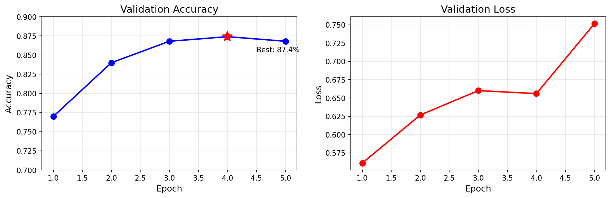

# IMDB-Sentiment-Finetuning
使用LoRA对BERT进行高效微调，实现IMDB有关电影评论的情感分析，准确率达87.4%
## 结果

| 指标 | 结果 |
|------|------|
| 准确率 | **87.4%** |
| 训练数据 | 500 条 |
| 验证数据 | 500 条 |
| 训练轮数 | 5 epochs |

##训练曲线



> 第4轮达到最佳准确率 87.4%，第5轮开始轻微过拟合,所以训练到第5轮结束（原代码设置了10轮）。

## 技术栈

- Python 3.13
- PyTorch
- Transformers
- PEFT (LoRA)
- Datasets

## 快速开始

```bash
# 1. 安装依赖
pip install -r requirements.txt

# 2. 运行 Notebook
jupyter notebook imdb_sentiment_finetuning.ipynb
